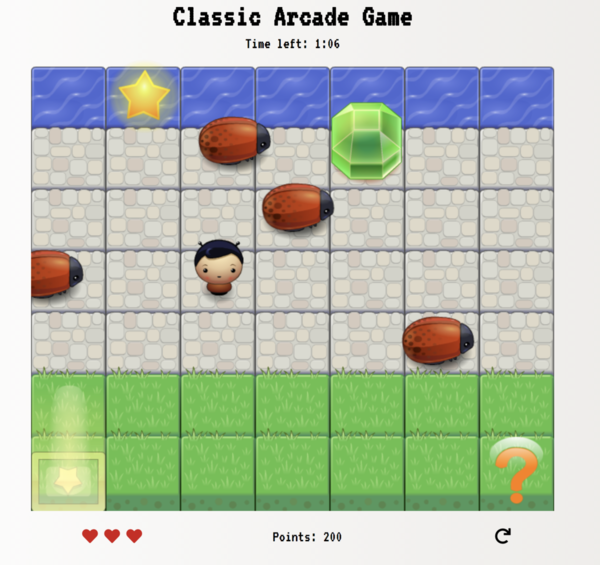

Classic-Arcade-Game-Clone
===============================
This is a classic frogger-like arcade game where the goal is for the player to collect as many gems as possible and reach the star at the top before the timer runs out. 

## Usage
* [Download zip](https://github.com/madeleinewoodbury/arcade-game-udacity/archive/master.zip)
* Extract zip file
* Open the index.html in your browser 

## How to Play
The player can move around using the arrow keys. The enemies move across the screen at various speeds making it challenging for the player to reach the top. The player has three lives to start, if the player collides with a bug or ends up in the water, a life will be lost. The game is over when there is no more lives or when the timer has run out.
There will at times be a heart for the player to pick up, this will result in an extra life.
The player can change it's avatar by moving to the selctor tile, or see the game instructions by moving to the question mark.

## Screenshot of the game

## Dependencies
* [Font Awesome](https://fontawesome.com/?from=io) - Star icons and replay button
* [Google Fonts](https://fonts.google.com/) - Font used

