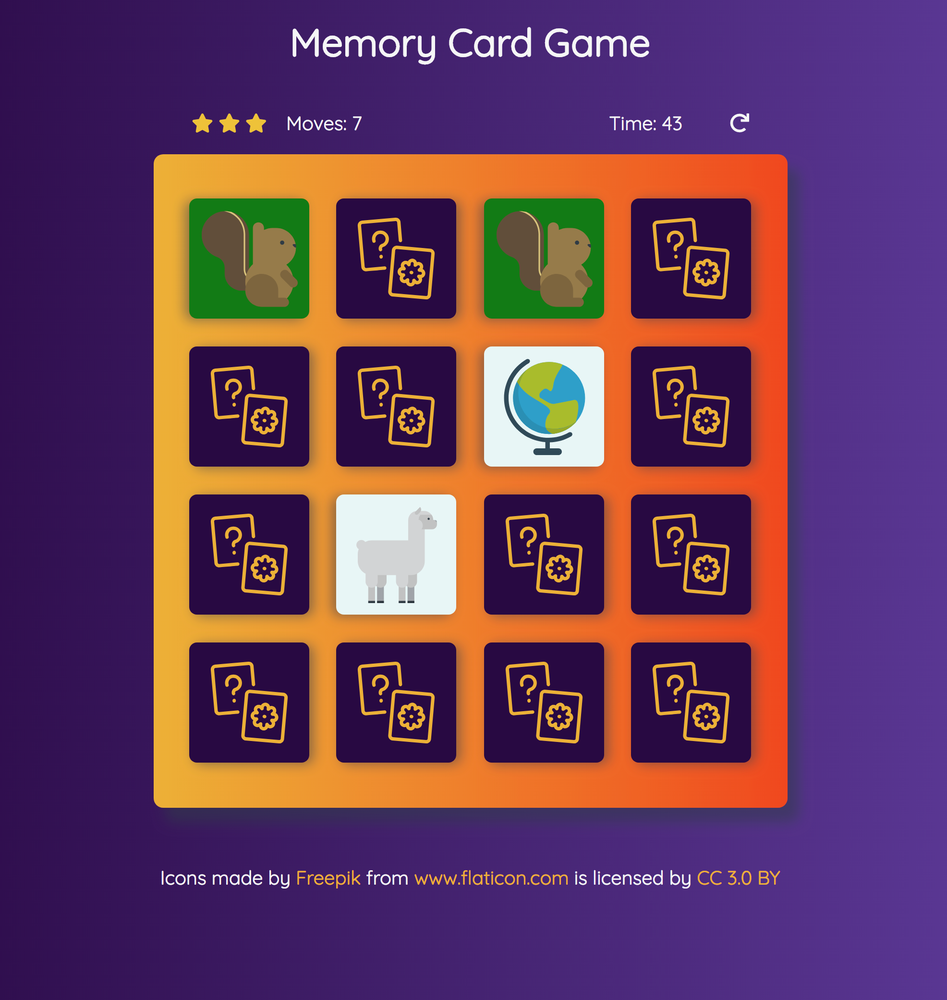

# Memory Card Game
A classic memory game where the object is to find all the matching cards

## Dependencies
* [Flaticon](https://www.flaticon.com/) - Image icons
* [Font Awesome](https://fontawesome.com/?from=io) - Star icons and replay button
* [Google Fonts](https://fonts.google.com/) - Font used

## How to Play
* Click on a card to flip it over
* Find the card that matches, a wrong guess will flip both cards over again
* When all the matches have been found, the game is finished
* Try finding all the matches in as few moves as possible to increase your star rating

## Screenshot of the game

## Credits
**Icons**: Icons made by [Freepik](http://www.freepik.com) from [www.flaticon.com](https://www.flaticon.com) is licensed by [CC 3.0 BY](http://creativecommons.org/licenses/by/3.0/)

